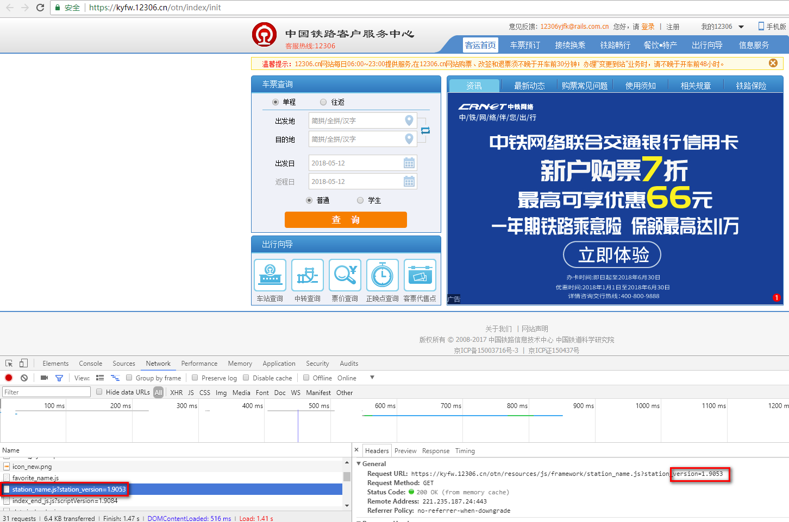
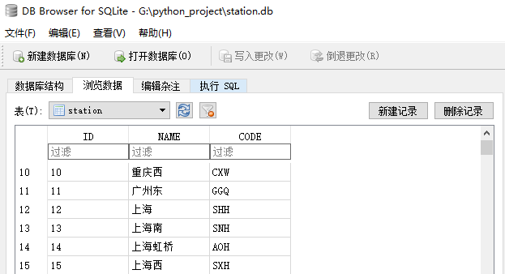

火车站电报码
=======
脚本的作用是从12306网站获取火车站电报码并存到[sqlite](https://www.sqlite.org/index.html)数据库中。
# 用法

```
python station.py station_version
```
# station_version获取方法
使用浏览器访问[12306购票页面](https://kyfw.12306.cn/otn/index/init)，打开开发者工具，刷新页面，在`network`中找到`https://kyfw.12306.cn/otn/resources/js/framework/station_name.js?station_version=1.9053`这行，`station_version`后即为版本号。


# 脚本输出
脚本会在当前目录下输出`station_name.txt`和`station.db`,其中`station_name.txt`是原始内容，`station.db`为包含车站名和电报码的SQLITE数据库文件。SQLITE数据库可使用[DB Browser for SQLite](http://sqlitebrowser.org/)浏览。



